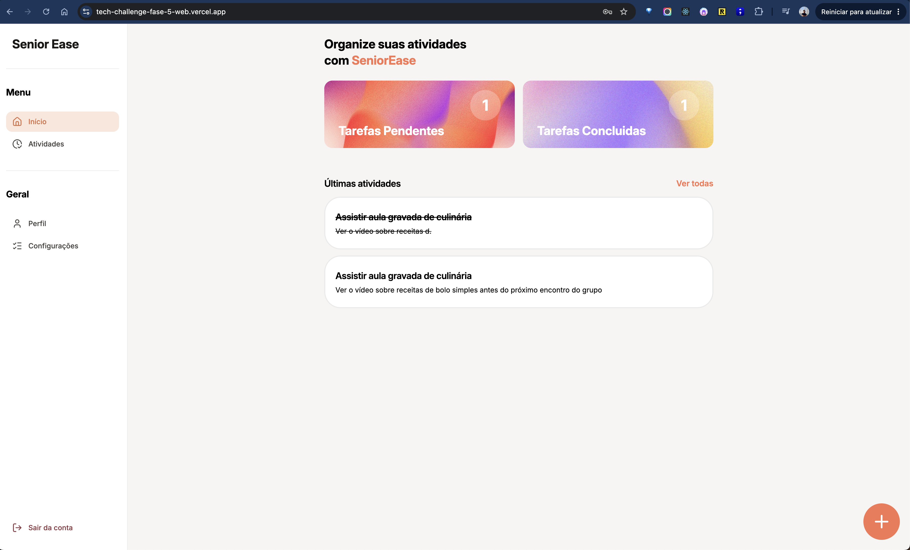
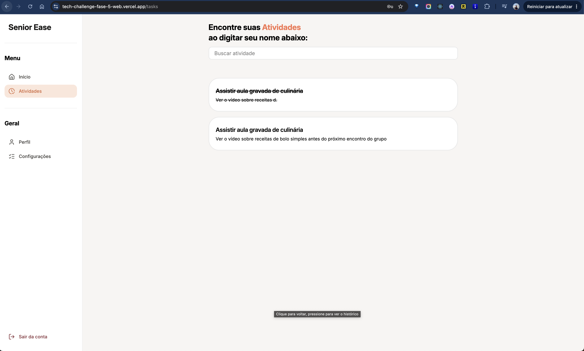
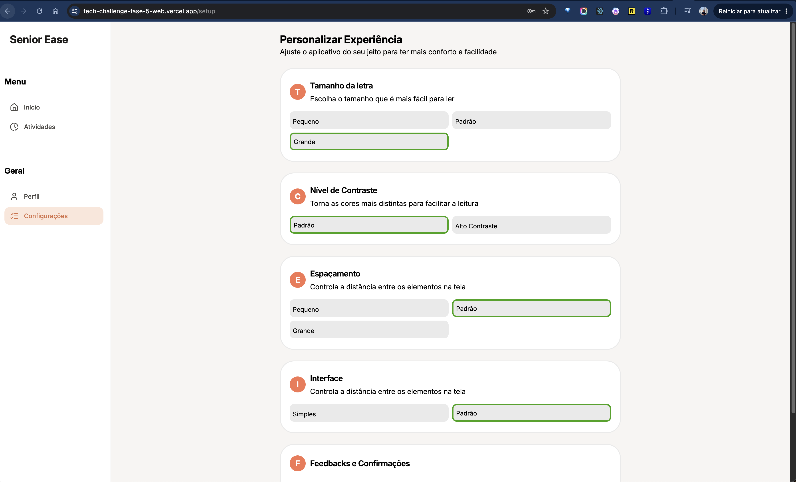
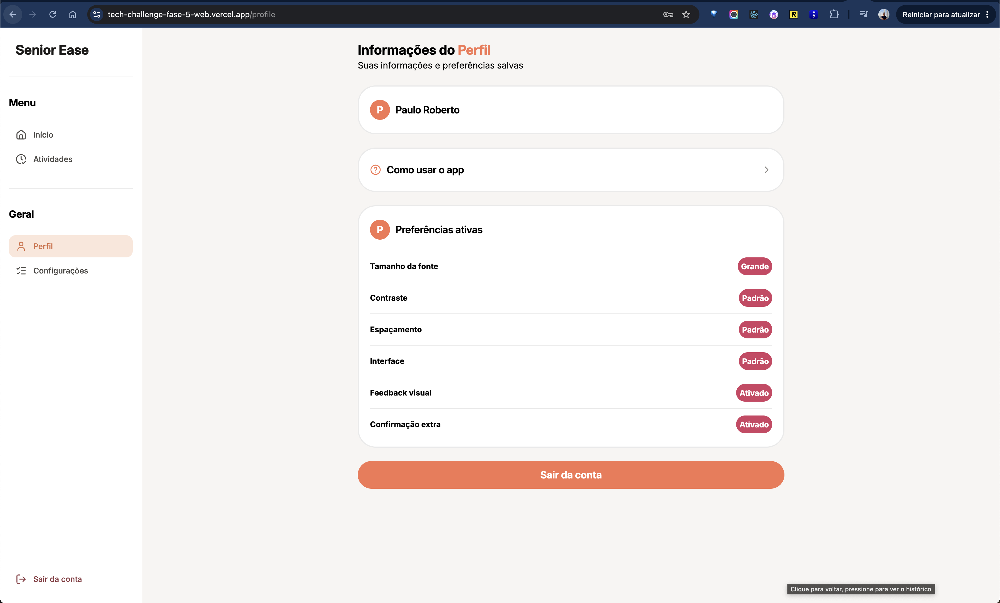
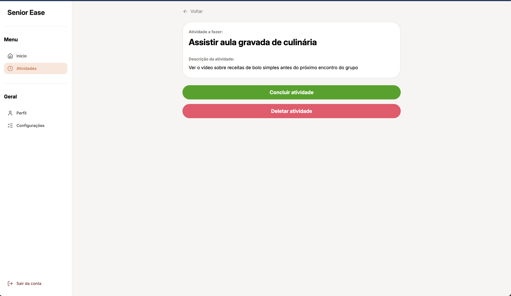
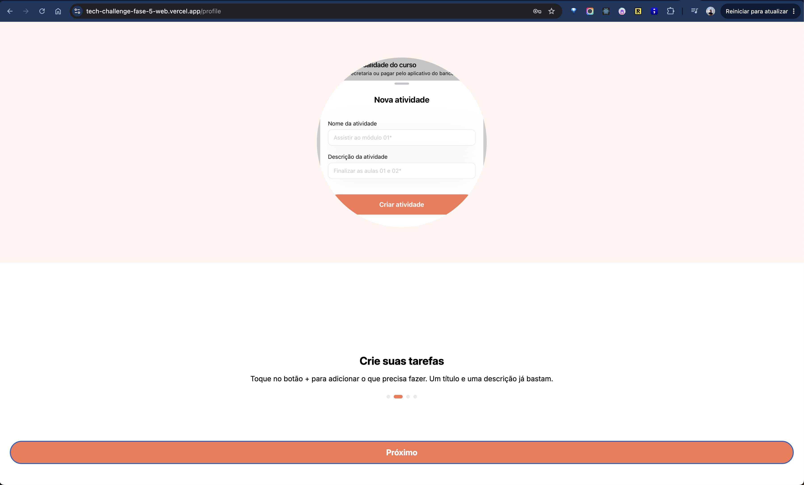
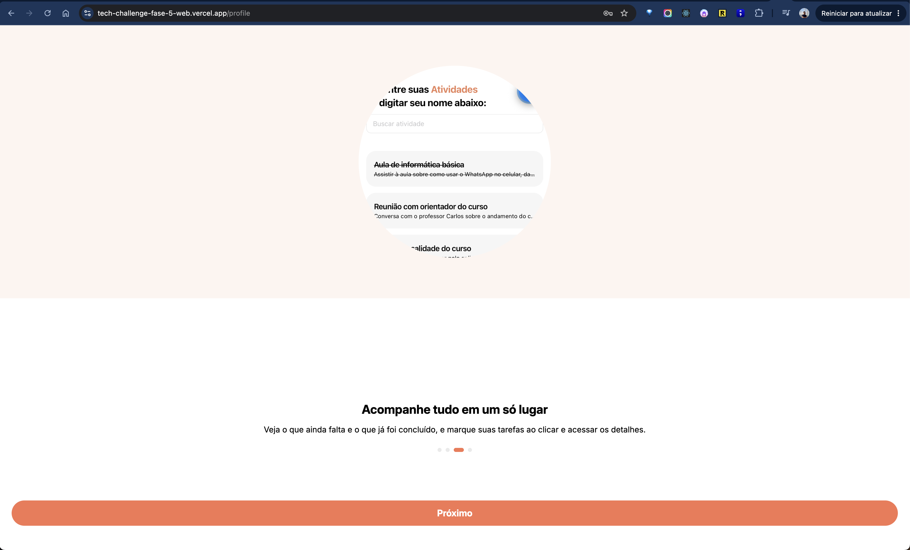
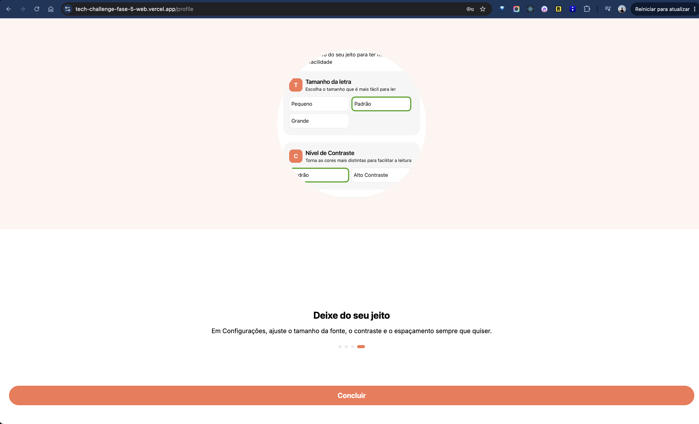

# Seja bem vindo ao SeniorEase 👋

Uma ferramenta voltada para auxiliar pessoas idosas a organizarem melhor a sua rotina de trabalho e estudos de forma simples e direta ao ponto.

<div align="left">
  
  
  
  
  
</div>
<div align="left">
  
  
  
  
  
</div>

---
### Links:
- **Repo**: [https://github.com/paoru5444/tech-challenge-fase-4](https://github.com/paoru5444/tech-challenge-fase-5-web)
- **Figma**: https://www.figma.com/design/B4pqplFIx5BaW5QVH2MFf7/SeniorEase?node-id=234-505&t=Hq36IcOCuNyHtN5o-1
- **Apresentação do Projeto**: https://www.youtube.com/watch?v=vOds35TRt5I
---

## Como começar


1. Instale as dependências
```bash
   npm install
```

1. Iniciar a aplicação em desenvolvimento
```bash
   npm run dev
```

2. Criar um build de produção
```bash
   npm run build
```

Obs: As configurações do firebase já estão no projeto.

Na saída do terminal, você encontrará opções para abrir o app em:

Você pode começar a desenvolver editando os arquivos dentro do diretório **app**.

---

## Ferramentas

- React JS
- React Router
- Vite
- Firebase
- Zod
- React Hook Form
- Redux Toolkit
- Tailwind
- Vitest
- Playright

---

## Arquitetura

O projeto foi construído com uma **arquitetura limpa** em conjunto com a **modular**, onde cada pasta dentro de `modules/` representa um módulo independente da aplicação, enquanto estrutura de Clean Architecture está distribuida dentro da pasta `app/`.

### Estrutura dos módulos
```
src/
|__app/
  └── domain/
          ├────── entities/
          ├────── repositories/
          ├────── usecases/
  └── providers/
  └── services/
  └── modules/
      └── <ModuleName>/
          ├── screens
          ├── components
          ├── hooks
          ├── store
          ├────── actions.ts
          ├────── slices.ts
          ├────── selectors.ts
```

### Escalabilidade

Essa estrutura torna o projeto preparado para crescer, seja para a adição de **novas features** ou para a inclusão de **novos integrantes** na equipe de desenvolvimento, sem que a organização do código seja comprometida. Os testes garantem a qualidade de operações essenciais e o ci/cd melhora o fluxo de entrega de novas features.

---

## Melhorias

- Adicionar RichText na descrição da atividade
- Adicionar sub-tarefas com check para atividades
- Criar passo a passo mais detalhados
- Adicionar data nas tarefas
- Adicionar prazo nas tarefas
- Segmetar ou agrupar tarefas
- Adicionar progressbar para acompanhar execução de tarefas com sub-tarefas.
- Adicionar mais testes de integração e unitários
- Adicionar ferramenta de Tracking e Monitoramento como o Sentry

---

- Desenvolvido com o ❤️ por Paulo Roberto
